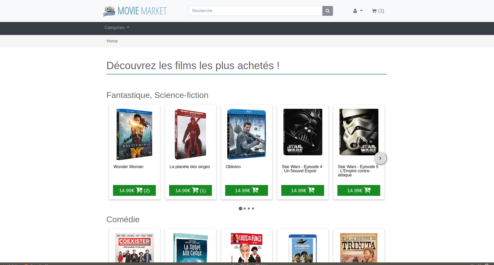

# com.m2gi.movieMarket-back

## Setup project

You need docker

### Launch server
``` bash
docker-compose up -d
```

This command download wildfly 11. It make take time <br />
Now you have a wildfly container with a mysql datastore configured which run on localhost:8080.

Check in go to [http://localhost:8080](http://localhost:8080)

You will see that




### Init Project
If you want reinitialize the project

```bash
docker-compose exec webapp make init
```

Check in go to [http://localhost:8080](http://localhost:8080)

## View documentations
[documentation](docs/docs.md)